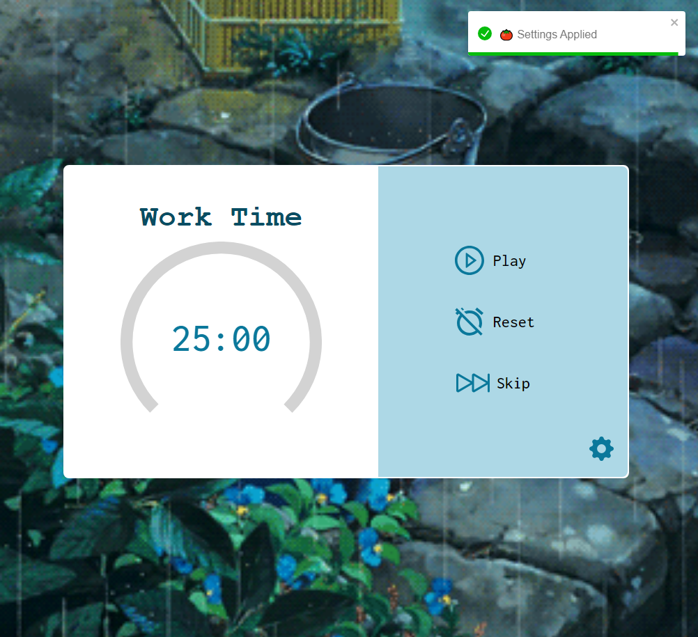
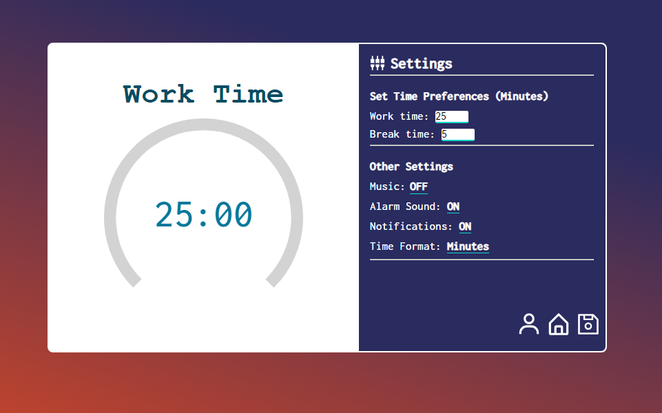
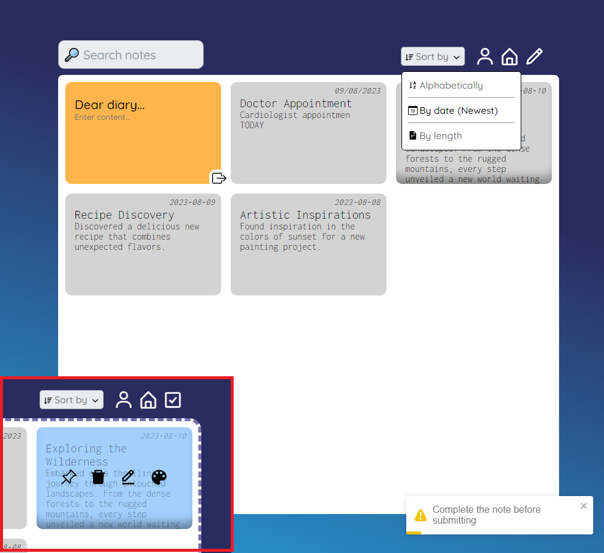

# Improvement Center App

The Improvement Center App is a versatile toolset designed to aid your personal development journey. With a focus on productivity and well-being, this app offers three essential tools: a Pomodoro Timer, a Journal App, and a Habit Tracker (currently in progress).
## Live: https://improvementcenter.netlify.app/

## Features

- **Pomodoro Timer:** Enhance your productivity using the Pomodoro Technique. Break your work into focused intervals, allowing for optimal concentration and efficiency.

- **Journal App:** Capture your thoughts, ideas, and reflections effortlessly. Organize and revisit your notes to gain insights and track your progress over time.

- **Habit Tracker (In Progress):** Work on forming positive habits and breaking negative ones. Monitor your habits and track your advancement towards self-improvement.

## Technologies Used

- **React:** The app is built using the React library, ensuring a dynamic and responsive user interface.

- **Sass Modules:** Styling is managed using Sass modules, providing a clean and organized design.

- **React Router:** Implement smooth navigation and routing within the app using React Router.

- **React Context API:** Manage state efficiently across components using the React Context API, enhancing overall performance and ease of development.

## Getting Started

1. Clone this repository to your local machine using `git clone`.
2. Navigate to the project directory using `cd improvement-center-app`.
3. Install the project dependencies using `npm install`.
4. Start the app using `npm start`.

## Contribution

Contributions are welcome! If you have any suggestions or improvements, feel free to create an issue or submit a pull request.

## Preview images

 

 

 

### License: [MIT](https://github.com/m1ckeyyy/improvement-center/blob/main/LICENSE)

---

Join us on your journey of self-improvement with the Improvement Center App. Unlock your potential and make progress towards your goals with our carefully crafted tools.
